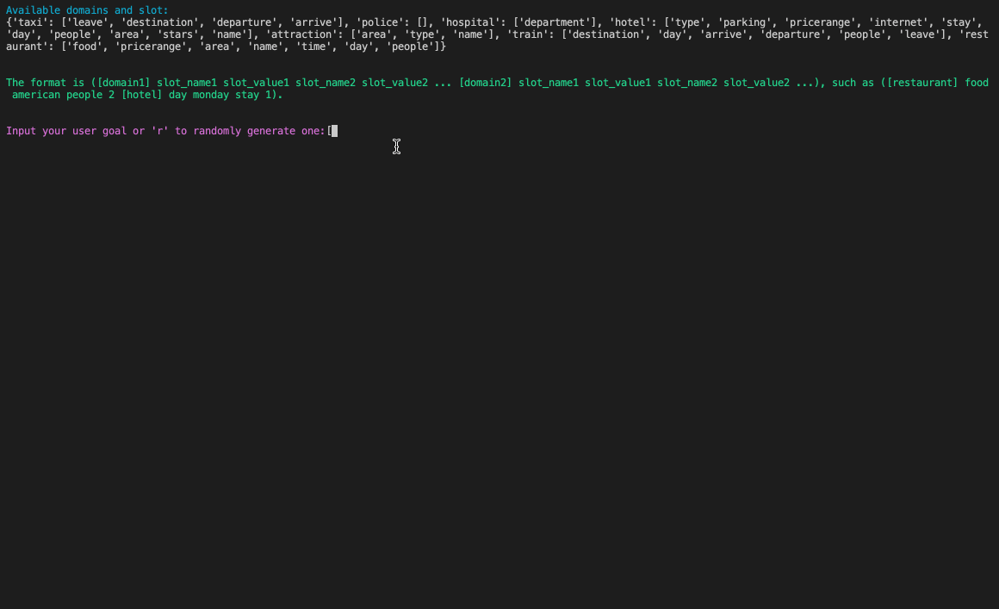

# Dialogic: Controllable Dialogue Simulation with In-Context Learning
This is the pytorch implementation of **Controllable Dialogue Simulation with In-Context Learning**.

<p align="center"></p>

## Introduction
Dialogic is a method that can generate and annotate task-oriented dialogues in a fully automatic manner, with in-context learning of large language models such as GPT-3.
The only requirements are a small seed dataset used to train the verifier and select in-context examples for GPT-3 prompting. 

Taking the [MultiWOZ](https://github.com/budzianowski/multiwoz) for example, given any user goal, such as booking a hotel (area is center, stay is 1, people is 2, bookday is Monday), and a restaurant (area is north, pricerange is moderate), DS-ICL can generate the corresponding dialogue along with annotations. An illustration of the generation process is presented above.

## Table of Contents
- [Dialogic: Controllable Dialogue Simulation with In-Context Learning](#dialogic-controllable-dialogue-simulation-with-in-context-learning)
  - [Introduction](#introduction)
  - [Table of Contents](#table-of-contents)
  - [Preparation](#preparation)
    - [Environment setup](#environment-setup)
    - [Data preparation](#data-preparation)
    - [Verifier preparation](#verifier-preparation)
  - [Simulation](#simulation)
    - [Dialogue simulation](#dialogue-simulation)
    - [Turn-level simulation](#turn-level-simulation)
    - [Demo](#demo)
  - [Training on simulated dialogues](#training-on-simulated-dialogues)
    - [PPTOD](#pptod)
    - [SimpleTOD](#simpletod)
    - [MinTL](#mintl)

## Preparation
We use [PPTOD](https://github.com/awslabs/pptod) as the verifier in this codebase. Most data and important files are in `./pptod` directory.

### Environment setup
Set up the environment for PPTOD and SimpleTOD. To set up the environment for MinTL, please refer to `./MinTL/README.md`.
```bash
pip install -r requirements.txt
python -m spacy download en_core_web_sm
```

### Data preparation
We use [MultiWOZ_2.3](https://github.com/lexmen318/MultiWOZ-coref) dataset by default. [MultiWOZ_2.0](https://github.com/budzianowski/multiwoz/blob/master/data/MultiWOZ_2.0.zip), [MultiWOZ_2.1](https://github.com/budzianowski/multiwoz/blob/master/data/MultiWOZ_2.1.zip), and [MultiWOZ_2.4](https://github.com/smartyfh/MultiWOZ2.4) datasets are also supported.
```bash
cd ./pptod/data/multiwoz
chmod +x ./data_preparation23.sh # MultiWOZ_2.3 dataset (by default)
# chmod +x ./data_preparation.sh # MultiWOZ_2.0 dataset
# chmod +x ./data_preparation21.sh # MultiWOZ_2.1 dataset
# chmod +x ./data_preparation24.sh # MultiWOZ_2.4 dataset
```
### Verifier preparation
We use [PPTOD](https://github.com/awslabs/pptod) as the verifier in this codebase. To use it, you should download the initial checkpoint you want and unzip it in the `./pptod/checkpoints` directory.
```bash
cd ./pptod/checkpoints
# Downloading Initial PPTOD-small Checkpoint:
chmod +x ./download_pptod_small.sh
./download_pptod_small.sh
# Downloading Initial PPTOD-base Checkpoint:
chmod +x ./download_pptod_base.sh
./download_pptod_base.sh
#Downloading Initial PPTOD-large Checkpoint:
chmod +x ./download_pptod_large.sh
./download_pptod_large.sh
```

Then you can use the script to train the verifier on the small seed dataset (1% few-shot setting by default):
```bash
cd ./pptod/E2E_TOD/sh_folder/small/training
chmod +x pptod_small_training_few_shot_0.01.sh
./pptod_small_training_few_shot_0.01.sh
```
Some important options include:
  - `--train_data_ratio`: the ratio of training data we use, i.e., the few-shot setting (1% by default).
  - `--ckpt_save_path`: the path where the trained verifier is saved.
<!-- The trained verifier is saved in `./pptod/E2E_TOD/ckpt23/small/few_shot_0.01/` directory. You can try other few-shot settings by changing `0.01` to any number in (0, 1]. -->

## Simulation
Put your OpenAI API key in `./pptod/E2E_TOD/dialogic_utils.py` to use GPT-3!

### Dialogue simulation
First, we extract the turn-level annotations. 
```bash
cd ./pptod/E2E_TOD/
# process the dialogues to get turn-level annotations
python dialogic_pre_process.py\
 --train_data_ratio 0.01
```

Generate the user goals, select in-context examples and construct the prompts.
```bash
cd ./pptod/E2E_TOD/
python dialogic_aug_e2e.py\
  --train_data_ratio 0.01\
  --augment_type combine\
  --augment_time 1\
  --k_shot 2\
  --temperature 0.2
```
Some important options include:
  - `--train_data_ratio`: the ratio of training data we use, the few-shot setting.
  - `--augment_type`: how to generate the user goals, options: [combine substitution, random].
  - `--augment_time`: how many times of the seed dataset we are going to augment.
  - `--k_shot`: how many in-context examples used in the prompt.
  - `--temperature`: the temperature when using the combine method.

Then you can use the following script to start simulating the dialogues:
```bash
cd ./pptod/E2E_TOD/sh_folder/small/simulation/
chmod +x ./pptod_small_few_shot_0.01_simulation.sh
./pptod_small_few_shot_0.01_simulation.sh
```
Some important options include:
  - `--train_data_ratio`: the ratio of training data we use, the few-shot setting.
  - `--pretrained_path`: the path of trained verifier.
  - `--output_save_path`: the path to store the simulated dialogues.
  - `--augment_dialog_path`: the path where the constructed prompts store. 
  - `--max_turn_num`: the maximum number of turns in each simulated dialog.
  - `--max_dialog_num`: the maximum number of dialogs simulated using gpt-3.
  - `--max_aug_num`: the size of simulated data w.r.t. the original seed data.
  - `--verify_bs`: whether to use the verifier to correct the generated belief state annotations.
  - `--verify_da`: whether to use the verifier to correct the generated dialog act annotations.
  - `--debug`: whether to print out the simulation process.
  - `--save`: whether to save the simulated dialogues.
We have put the simulated dialogues under 1%, 5%, and 10% settings in `./pptod/E2E_TOD/simulation_result23/small/few_shot_x` (x in [0.01, 0.05, 0.1]) directory.

You will see the dialogue simulation process as:
```console
Original GPT-3 generation of User: You require([restaurant] area is east): i am looking for a restaurant in the east area
Verifier predicted belief state: [restaurant] area east
Corrected belief state: [restaurant] area east
Corrected GPT-3 generation of User: You require([restaurant] area is east): i am looking for a restaurant in the east area
DB search result: [db_3]
Verifier generated Action: [restaurant] [inform] choice [request] food
Verifier generated Response: there are [value_choice] options in the [value_area] ranging from [value_price] to [value_price] . do you have a price range you would prefer ?
Corrected GPT-3 generation of System: Assistant([restaurant] [inform] choice [request] food): there are [value_choice] restaurants in the east area , what type of food are you looking for ?

--------------------------------- turn 0 ---------------------------------
User: i am looking for a restaurant in the east area
Assistant: there are [value_choice] restaurants in the east area , what type of food are you looking for ?
--------------------------------------------------------------------------

Original GPT-3 generation of User: You require([restaurant] food is korean): korean food please
Verifier predicted belief state: [restaurant] area east food korean
Corrected belief state: [restaurant] area east food korean
Corrected GPT-3 generation of User: You require([restaurant] food is korean): korean food please
DB search result: [db_0]
Verifier generated Action: [restaurant] [nooffer] food area
Verifier generated Response: i have [value_choice] options for you . do you have a price range you are looking for ?
Corrected GPT-3 generation of System: Assistant([restaurant] [nooffer] food area): i am sorry we do not have any korean restaurants in the east area .

--------------------------------- turn 1 ---------------------------------
User: korean food please
Assistant: i am sorry we do not have any korean restaurants in the east area .
--------------------------------------------------------------------------
......
```

### Turn-level simulation
You can use the following script to start simulating dialogue turns for DST augmentation.
```bash
cd ./pptod/E2E_TOD/
python dialogic_aug_dst.py\
  --train_data_ratio 0.01\
  --augment_time 2\
  --k_shot 2\
  --temperature 0.2
```

### Demo
You can type into your user goal or use randomly generated user goals to see how the dialogue is generated.
```bash
cd ./pptod/E2E_TOD/sh_folder/small/demo
chmod +x ./pptod_small_few_shot_0.01_simulation.sh
./pptod_small_few_shot_0.01_demo.sh
```
An illustration can be seen [here](#dialogic-controllable-dialogue-simulation-with-in-context-learning).


## Training on simulated dialogues 
Convert the format of simulated dialogues for E2E training.
```bash
cd ./pptod/E2E_TOD/
python dialogic_post_process.py\
  --data_type E2E\
  --raw_data_path ./simulation_result23/small/few_shot_0.01/combine0.2_2_shot_augment_dialog_turn_info_train_ratio_0.01_simulation_result.json
```
Convert the format of simulated dialogue turns for DST training.
```bash
cd ./pptod/E2E_TOD/
python dialogic_post_process.py\
  --data_type DST\
  --raw_data_path ../data/multiwoz/data/multi-woz-2.3-dialogic-processed/2_shot_augment_x2_dst_turn_info_train_ratio_0.01.json
```

### PPTOD
You can use the following scripts to train PPTOD:
```bash
# E2E
cd ./pptod/E2E_TOD/sh_folder/small/training/
chmod +x ./pptod_small_train_few_shot_0.01_augx1.sh
./pptod_small_train_few_shot_0.01_augx1.sh
# DST
cd ./pptod/DST/sh_folder/small/training/
chmod +x ./pptod_small_train_few_shot_0.01.sh
./pptod_small_train_few_shot_0.01.sh
```

### SimpleTOD
Convert the format of simulated dialogues to fit SimpleTOD.
```bash
# E2E
cd ./pptod/E2E_TOD/
python dialogic_export_dialog_e2e.py\
  --train_data_ratio 0.01\
  --aug_train_data_file multi-woz-fine-processed-train-combine0.2_2_shot_augment_dialog_turn_info_train_ratio_0.01_simulation_result.json\
  --save_data_path_prefix ../../simpletod/resources_e2e_2.3_0.01_augx1/multi-woz
# DST
cd ./pptod/DST/
python dialogic_export_dialog_dst.py\
  --train_data_ratio 0.01\
  --aug_train_data_file multi-woz-fine-processed-train-2_shot_augment_x2_dst_turn_info_train_ratio_0.01.json\
  --save_data_path_prefix ../../simpletod/resources_DST_2.3_0.01_augx2/multi-woz
```

Then you can use the simulated dialogue to train SimpleTOD:
```bash
cd ./simpletod/
# create data
chmod +x create_dataset.sh
./create_dataset.sh
# E2E training
./train_end2end.sh 7 gpt2 gpt2 1
# DST training
./train_dst.sh 7 gpt2 gpt2 1
```
Use the following command for inference on test set:
```bash
CUDA_VISIBLE_DEVICES=$GPU python generate_dialogue.py $CHECKPOINT $DECODING
```
Use the following command for evaluation:
```bash
python evaluate_multiwoz.py $MODEL_OUTPUT
```

### MinTL
You should use another environment for experiments on MinTL.
```bash
cd ./MinTL
pip install -r requirements.txt
```
Convert the format of simulated dialogues to fit MinTL.
```bash
# E2E
cd ./pptod/E2E_TOD/
python dialogic_export_dialog_e2e.py\
  --train_data_ratio 0.01\
  --aug_train_data_file multi-woz-fine-processed-train-combine0.2_2_shot_augment_dialog_turn_info_train_ratio_0.01_simulation_result.json\
  --save_data_path_prefix ../../MinTL/generated_data/e2e_2.3_0.01_augx1/
# DST
cd ./pptod/DST/
python dialogic_export_dialog_dst.py\
  --train_data_ratio 0.01\
  --aug_train_data_file multi-woz-fine-processed-train-2_shot_augment_x2_dst_turn_info_train_ratio_0.01.json\
  --save_data_path_prefix ../../MinTL/generated_data/dst_2.3_0.01_augx2/
```

Then you can use the simulated dialogue to train MinTL:
```bash
export PYTHONPATH='$PROJECT_PATH/MinTL/damd_multiwoz'
# E2E training
CUDA_VISIBLE_DEVICES=1 python train.py --mode train --context_window 2 --pretrained_checkpoint t5-small --cfg seed=557 batch_size=32 --use_db True --generated_data_file e2e_2.3_0.01_augx1
# DST training
CUDA_VISIBLE_DEVICES=1 python DST.py --mode train --context_window 3 --cfg seed=557 batch_size=32 --generated_data_file dst_2.3_0.01_augx2
```


